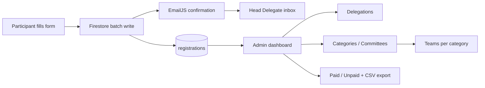

<div align="center">

# 🏆 JTC Events

### Registration & Management Portal for **JTC MUN** and **JTC Sports Fest**

A single-page web app where schools register delegations, head delegates get an instant confirmation email, and organisers manage every submission from a secure admin dashboard.

<br>


[Live Demo](https://YOUR_USERNAME.github.io/YOUR_REPO/) · [Report a Bug](https://github.com/YOUR_USERNAME/YOUR_REPO/issues) · [Request a Feature](https://github.com/YOUR_USERNAME/YOUR_REPO/issues)

</div>

---

## 📑 Table of Contents

- [About](#-about)
- [Features](#-features)
- [Tech Stack](#-tech-stack)
- [How It Works](#-how-it-works)
- [Getting Started](#-getting-started)
- [Configuration](#-configuration)
- [Data Model](#-data-model)
- [Security](#-security)
- [Deployment](#-deployment)
- [Project Structure](#-project-structure)
- [Troubleshooting](#-troubleshooting)
- [Contributing](#-contributing)
- [License](#-license)

---

## 📖 About

**JTC Events** is the official portal for two flagship school events:

| Event | What it covers |
|-------|----------------|
| 🌍 **JTC MUN** | Model United Nations. Delegations of up to 7 delegates register with committee preferences. |
| ⚽ **JTC Sports Fest** | Multi-sport competition. Schools register a delegation and enter teams or players per sport category. |

The whole app is one `index.html` file. There is no framework, bundler or server to maintain. Firebase handles data and authentication, and EmailJS sends confirmation emails straight from the browser.

## ✨ Features

### For participants
- 📝 **Delegation registration** for both events, with a clear step-by-step flow
- 🎯 **Sports Fest division picker** (Under 15 / Under 19)
- 🃏 **Category selection cards**. Tap a card to open its form and turn it green; tap again to remove it. Answers already typed in other categories are kept.
- 👥 **Automatic team and player fields** based on each sport's rules (main players, substitutes, individual entries)
- ✅ **Validation**: a single student can enter a maximum of 3 categories
- 📧 **Instant confirmation email** to the Head Delegate's Gmail
- 📜 **Code of Conduct**, rules and management team pages for each event
- 📱 **Fully responsive**. Grids collapse to one column on phones.

### For admins
- 🔐 **Secure admin login** (Firebase Authentication)
- 🗂️ **Submissions dashboard** with drill-down navigation:
  - **Event** → MUN or Sports Fest
  - **Type** → Delegations or Categories/Committees
  - **Category** → every team registered under that category or committee
- 💳 **Payment tracking**. Mark any registration as Paid or Unpaid.
- 📥 **Export to CSV** for any filtered view
- 🗑️ Delete submissions, live-updating tables (no refresh needed)
- 🛠️ **Content management**: add or remove committees, sports categories, management members, edit rules, upload Code of Conduct files, and edit form fields

## 🧰 Tech Stack

| Layer | Technology |
|-------|-----------|
| Front end | HTML5, CSS3 (custom glassmorphism theme), vanilla JavaScript (ES6+) |
| Database | Cloud Firestore |
| Auth | Firebase Authentication (email and password) |
| File storage | Firebase Storage |
| Email | [EmailJS](https://www.emailjs.com/) (`@emailjs/browser` v3) |
| Hosting | Any static host (GitHub Pages, Firebase Hosting, Netlify, Vercel) |

## 🔄 How It Works



Each Sports Fest registration writes **one Delegation record** (the complete form) plus **one Category record per selected sport** in a single atomic batch. Each MUN registration writes one Delegation record plus one record per committee chosen. This is what powers the admin drill-down.

## 🚀 Getting Started

### Prerequisites
- A [Firebase](https://console.firebase.google.com/) project with **Firestore**, **Authentication** (Email/Password) and **Storage** enabled
- An [EmailJS](https://dashboard.emailjs.com/) account with an email service and a template
- Any modern browser. No Node.js or build tools needed.

### Run locally

```bash
# 1. Clone the repository
git clone https://github.com/YOUR_USERNAME/YOUR_REPO.git
cd YOUR_REPO

# 2. Serve it (any static server works)
python -m http.server 8000
# or: npx serve .

# 3. Open http://localhost:8000
```

> 💡 Use a local server instead of double-clicking the file, since Firebase and EmailJS behave better over `http://`.

### Create your first admin
1. Firebase Console → **Authentication** → **Users** → **Add user**
2. Enter an email and password
3. On the site, click **Admin Login**. The **Submissions** tab appears once you're signed in.

## ⚙️ Configuration

### 1. Firebase
In `index.html`, replace the `firebaseConfig` object with the values from **Project settings → Your apps → Web app**:

```js
const firebaseConfig = {
  apiKey: "...",
  authDomain: "your-project.firebaseapp.com",
  projectId: "your-project",
  storageBucket: "your-project.firebasestorage.app",
  messagingSenderId: "...",
  appId: "..."
};
```

Then add your site's domain under **Authentication → Settings → Authorized domains**.

### 2. EmailJS
Set your keys in `index.html`:

```js
emailjs.init("YOUR_PUBLIC_KEY");

const EMAILJS_SERVICE_ID  = "your_service_id";
const EMAILJS_TEMPLATE_ID = "your_template_id";
```

In your EmailJS template, set **To Email** to `{{to_email}}`, then use any of these variables in the body:

| Variable | Description |
|----------|-------------|
| `{{to_email}}` | Head Delegate's email (recipient) |
| `{{to_name}}` | Head Delegate's name |
| `{{school_name}}` | School / institution |
| `{{delegation_name}}` | Delegation name |
| `{{event_name}}` | Event (MUN or Sports Fest) |
| `{{division}}` | Sports Fest division (Under 15 / Under 19) |
| `{{categories_list}}` | Selected categories with teams and players |
| `{{submission_date}}` | Date of registration |
| `{{form_details}}` | Full submitted form as text |

> ⚠️ Variable names are **case-sensitive**. If a value shows up blank in the email, open the EmailJS **History** tab and compare the received variables with your template.

## 🗃️ Data Model

**`registrations`** collection (one document per record):

```js
{
  eventType: "MUN" | "Sports Fest",
  subType: "Delegations" | "Categories",
  categoryOrCommittee: "Futsal",          // category, committee or delegation name
  parentDelegationId: "abc123",           // set on Categories records
  paymentStatus: "paid" | "unpaid",
  submittedAt: <serverTimestamp>,
  formData: { /* label → value */ }
}
```

Other collections: `committees`, `sports`, `sports_categories`, `management`, `rules`, `config`, `documents`.

## 🔒 Security

Firebase web keys are identifiers rather than secrets, so **your Firestore and Storage rules are what protect the data**. A safe starting point for `registrations` is public create and admin-only everything else:

```js
rules_version = '2';
service cloud.firestore {
  match /databases/{database}/documents {

    // Anyone can register, only signed-in admins can read or change registrations
    match /registrations/{id} {
      allow create: if true;
      allow read, update, delete: if request.auth != null;
    }

    // Public site content, admin-only writes
    match /{collection}/{id} {
      allow read: if true;
      allow write: if request.auth != null;
    }
  }
}
```

- Only create admin accounts you trust. Every signed-in user is treated as an admin.
- Restrict your EmailJS public key to your domain in the EmailJS dashboard.
- Never commit private service-account keys.

## 🌐 Deployment

**GitHub Pages**
1. Push the project to GitHub
2. **Settings → Pages** → Source: `main` branch, `/ (root)`
3. Add `YOUR_USERNAME.github.io` to Firebase **Authorized domains**

**Firebase Hosting**
```bash
npm install -g firebase-tools
firebase login
firebase init hosting     # public directory: .   (single-page app: No)
firebase deploy
```

Netlify and Vercel also work. Drag the folder in or connect the repo.

## 📁 Project Structure

```
.
├── index.html      # The entire app: markup, styles and scripts
├── SF.png          # Sports Fest home card image
├── JTCMUN.png      # MUN home card image
└── README.md
```

## 🛠️ Troubleshooting

| Problem | Fix |
|---------|-----|
| Submissions tab is empty | Check the browser console for `Missing or insufficient permissions`. Your Firestore rules must let signed-in admins read `registrations`. |
| Confirmation email is not delivered | Check **Spam**. Confirm the template's **To Email** is `{{to_email}}` and the email service is still connected in EmailJS. |
| Email arrives but values are blank | Variable names in the template must match the table above exactly. Check EmailJS **History**. |
| Admin login fails on the live site | Add your domain under Firebase **Authentication → Authorized domains**. |
| Changes don't appear after deploying | Hard-refresh with `Ctrl + Shift + R` to clear the cached script. |

## 🤝 Contributing

Contributions, issues and feature requests are welcome.

1. Fork the project
2. Create your branch: `git checkout -b feature/amazing-feature`
3. Commit your changes: `git commit -m "Add amazing feature"`
4. Push to the branch: `git push origin feature/amazing-feature`
5. Open a Pull Request

## 📄 License

Distributed under the **MIT License**. See `LICENSE` for details.

---

<div align="center">

Built for **JTC MUN** and **JTC Sports Fest** 🏆

⭐ If this project helped you, consider giving it a star!

</div>
